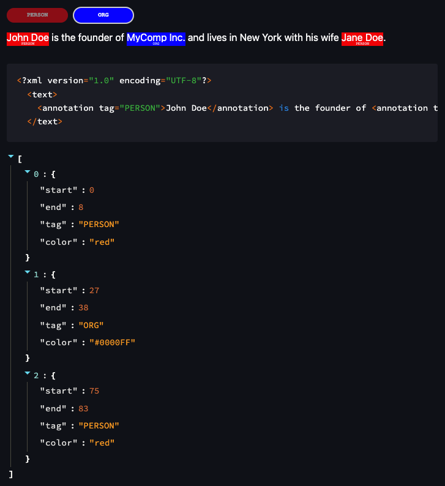

# Text Highlighter

A Streamlit component for annotating text using text highlighting. Useful for NLP tasks.

## Installation

You can install the Text Highlighter package using the following command:

```bash
pip install --upgrade text-highlighter
```

## Usage

The package can be used as follows:

```python
from text_highlighter import text_highlighter
import streamlit as st

# Basic usage
result = text_highlighter(
    text="John Doe is the founder of MyComp Inc. and lives in New York with his wife Jane Doe.",
    labels=[("PERSON", "red"), ("ORG", "#0000FF")],
    # Optionally you can specify pre-existing annotations:
    annotations=[
        {"start": 0, "end": 8, "tag": "PERSON"},
        {"start": 27, "end": 38, "tag": "ORG"},
        {"start": 75, "end": 83, "tag": "PERSON"},
    ],
)

# Show the results (in XML format)
st.write(result.to_xml())

# Show the results (as a list)
st.write(result)
```

In the `example.py` script you can find the above example. You can run the example as follows:

```bash
streamlit run example.py
```

The output will look like this:



## Contribute

Feel free to add a pull request or open an issue if you have any questions or suggestions.
