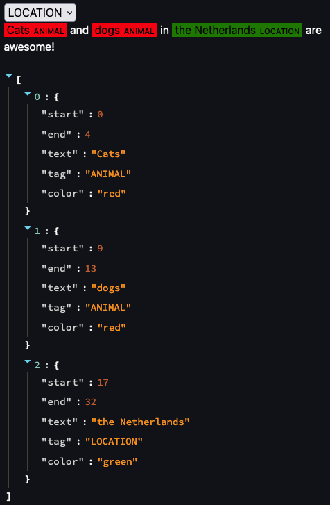

# Text Highlighter

A Streamlit component for annotating text using text highlighting. Useful for NLP tasks.

## Installation

You can install the Text Highlighter package using the following command:

```bash
pip install --upgrade text-highlighter
```

## Usage

The package can be used as follows:

```python
from text_highlighter import text_highlighter
import streamlit as st

# Basic usage
result = text_highlighter(
    text="Cats and dogs in the Netherlands are awesome!", labels=["ANIMAL", "LOCATION"]
)

# Show the results
st.write(result)
```

In the `example.py` script you can find the above example. You can run the example as follows:

```bash
streamlit run example.py
```

The output will look like this:



## Contribute

Feel free to add a pull request or open an issue if you have any questions or suggestions.
